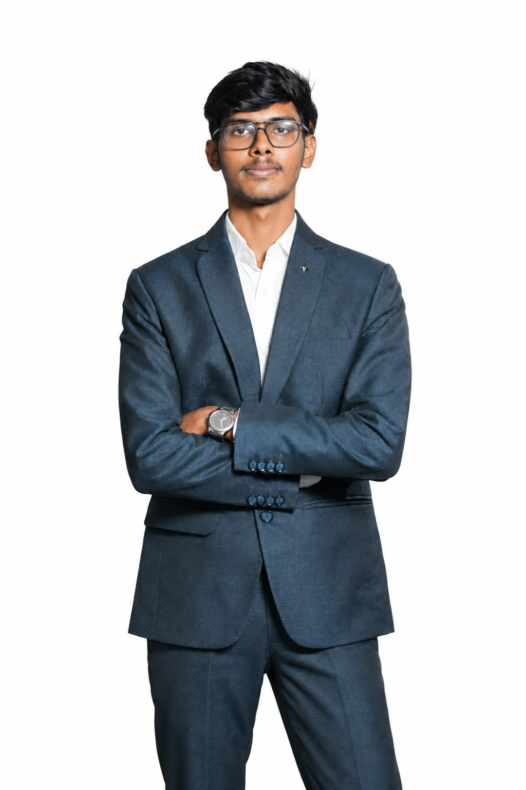
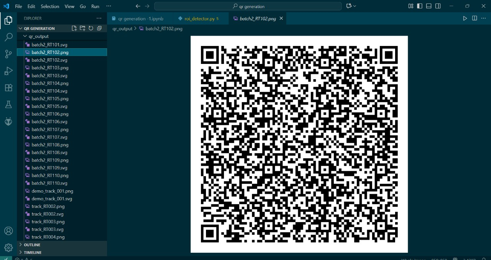
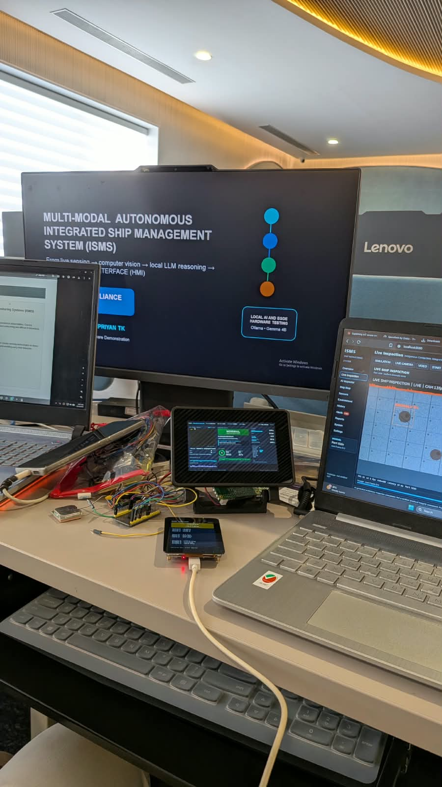
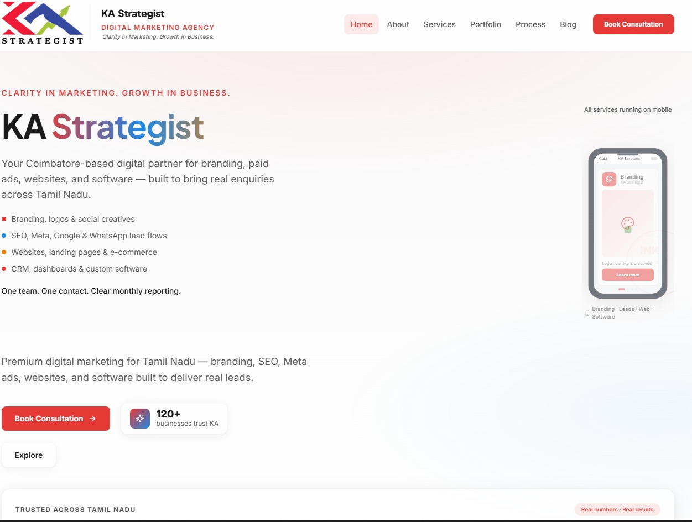
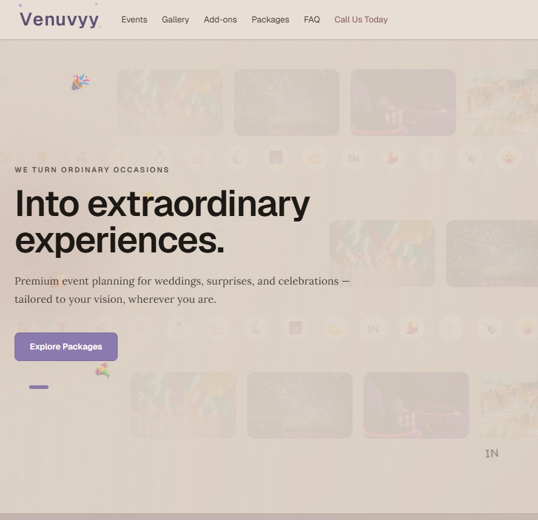

<div align="center">

# JEEVAPRIYAN T K

### Electronics • AI • Embedded • Robotics

Building intelligent systems where hardware meets software.

<br>



<br><br>

[LinkedIn](https://www.linkedin.com/in/jeevapriyan-t-k-0ba8b532a?utm_source=share_via&utm_content=profile&utm_medium=member_android) &nbsp; | &nbsp;
[Instagram](https://www.instagram.com/_.jeevapriyan._502?stkn=MmU4NjdoMHlteTE1) &nbsp; | &nbsp;
[Portfolio](YOUR_PORTFOLIO_URL)

</div>

---

<div align="center">

## WHAT I BUILD

<br>

<table>
<tr>
<td align="center" width="33%">

### EMBEDDED

ESP32  
STM32  
Arduino  
Raspberry Pi

</td>

<td align="center" width="34%">

### INTELLIGENCE

Edge AI  
Computer Vision  
OpenCV  
Image Processing

</td>

<td align="center" width="33%">

### SYSTEMS

IoT  
Robotics  
Electronics  
PCB Design

</td>
</tr>
</table>

</div>

---

## ABOUT

I’m an Electronics & Communication Engineering student focused on
building practical systems at the intersection of hardware, software
and artificial intelligence.

My interests include embedded systems, edge AI, computer vision,
robotics, IoT and intelligent automation.

I enjoy taking an idea from **prototype → integration → testing → working system**.

---

<div align="center">

## FEATURED WORK

<br>

<table>
<tr>

<td align="center" width="50%">



<br>

### AI QR Engraving Robot

Computer vision based robotic system designed for defect detection,
QR placement, automated engraving and post-engraving verification.

<br>

**AI • Computer Vision • Robotics**

</td>

<td align="center" width="50%">



<br>

### Smart Ship Inspection

Multi-modal ship management and inspection system using Raspberry Pi,
sensors, computer vision and local Edge AI processing.

<br>

**Raspberry Pi • Edge AI • Sensors**

</td>

</tr>

<tr>

<td align="center" width="50%">



<br>

### KA Strategist

Full-stack digital marketing platform with a modern web interface
and database-backed architecture.

<br>

**Next.js • Supabase • Full Stack**

</td>

<td align="center" width="50%">



<br>

### Venuvyy Events

Event-focused web platform designed for discovering,
exploring and managing event experiences.

<br>

**Web Development • UI/UX • Database**

</td>

</tr>
</table>

</div>

---

## ACHIEVEMENTS

### SMARTATHON '26

**First Prize — Dhanalakshmi Srinivasan University, Trichy**

Built, integrated, tested and presented a complete working
MVP within **24 hours** as part of **Team APEX ALLIANCE**.

**Prize:** ₹20,000

---

### SARVAM 2026

**Second Place — EASA College Hackathon**

Achieved **Second Place** as part of **Team QYANTARA**.

---

## CURRENTLY EXPLORING

```text
Embedded Systems
Edge AI
Computer Vision
Robotics
IoT
PCB Design
Intelligent Automation
